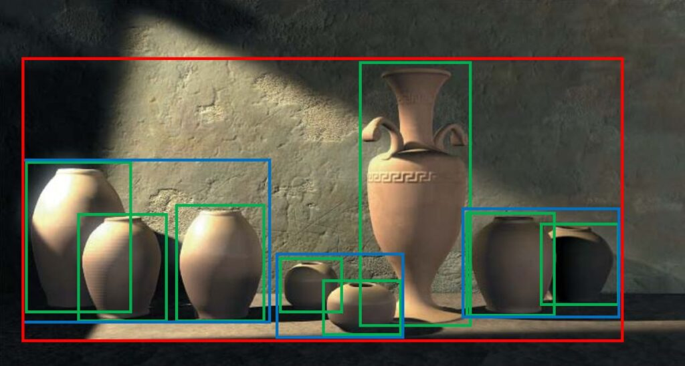

# 03-31-2025_bounding-volume-hierarachy-but-its-2d-for-now
practice guys. practice.

## The Concept

I built a boids simulation that uses a BVH (bounding volume hierarchy) to optimize the boid computation and make it fast. 

Yep. I did that.


## How to Run

1. Clone the repository
2. Install the dependencies
   ```bash
   pip install -r requirements.txt
   ```
3. Run the simulation
   ```bash
   python main.py
   ```

| Function                | Key |
|-------------------------|-----|
| Reset Simulation        | R   |
| Pause/Resume Simulation | P   |
| Quit Application        | ESC   |
| Pause Simulation        | Backspace   |

## How it Works

I'll keep it simple.

It run boids simulation, meaning -- bird fly in flock and boid fly in flock. 

There's 3 forces applied:
1. Separation - bird stay away
2. Alignment - bird go same direction
3. Cohesion - bird go to center

Then, I added a BVH.

It's an optimization technique that allows us to group objects in a hierarchy, so we can quickly check for collisions and other interactions.

Very similar to a tree -- although traditionaly used in 3D and for ray tracing.



## BVH Performance Increase

Under the same initial starting conditions:

| Number of Boids | Time (ms) | Time with BVH (ms) | Speedup |
|-----------------|-----------|---------------------|---------|
| 100             |  10.161      | 8.099                 | 1.25x      |
| 1000            | 215.328       | 69.931                 | 3.08x     |
| 2000           | 779.289      | 171.662                 | 4.54x     |
| 5000          | 4608.583     | 801.205               | 5.75x     |

## Future Work

Gonna add in multiprocessing for CPU side cuz i wanna make things faster.
Gonna add in GPU side too for rendering cuz why not.

Maybe I can get compute shaders to works.

Who knows.